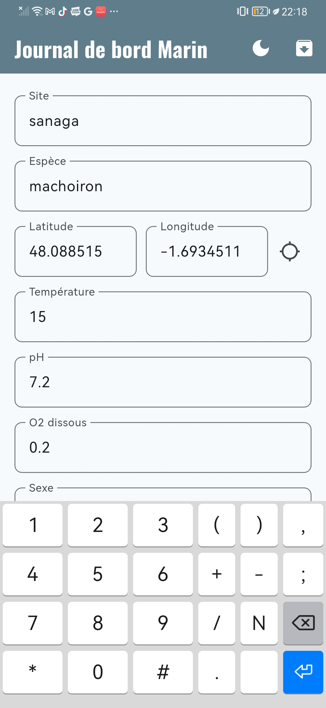
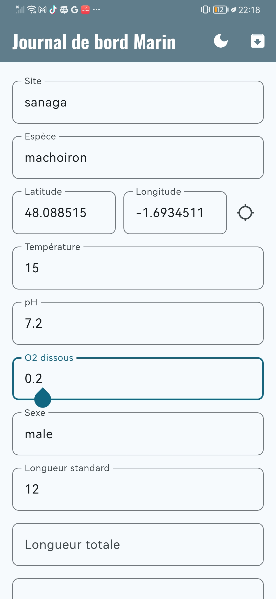
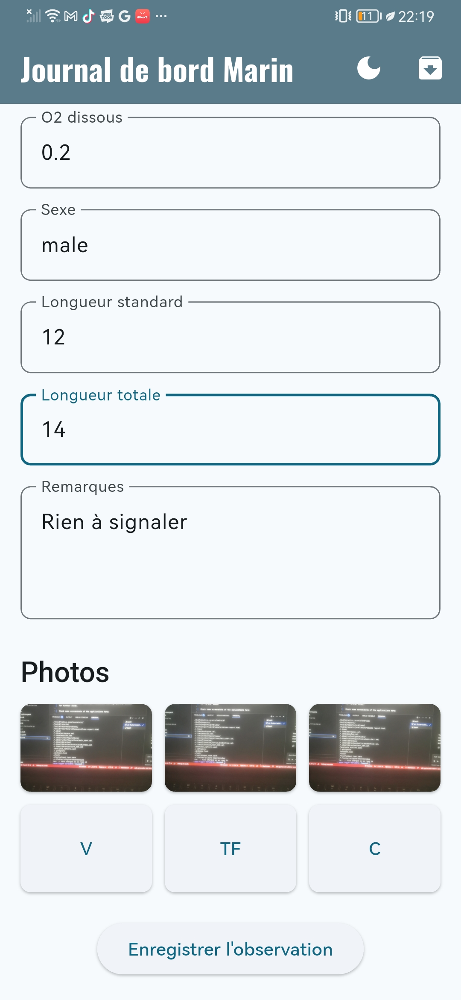

# Description

Designed to streamline field research for a Master’s thesis in Aquaculture, this specialized Android application provides a digital solution for standardized fish data collection. The app enables researchers to efficiently log key physiological parameters—such as height and weight—while automatically capturing precise geographical coordinates for environmental mapping. To support detailed morphological analysis, the interface includes a dedicated workflow for capturing six standardized photographs of each specimen from specific orientations, ensuring a consistent and high-quality dataset for further study.

Check some screenshots of my android application: 

<p align="center">
  
  
  
</p>

To get the apk you would have to download this repo and follow the installation process described below or you can also contact me at: [loicyng@gmail.com](mailto:loicyng@gmail.com)

## Table of Contents
- [Description](#description)
- [Stack](#stack)
- [Getting Started](#getting-started)
- [Installation](#installation)
- [Citation](#citation)
- [Author](#author)
- [License](#license)
- [Support](#support)

## Stack

*   **Flutter:** The application is built using the Flutter framework for cross-platform development.
*   **Dart:** The programming language used for Flutter development.
*   **sqflite:** A Flutter plugin for SQLite, used for local database storage.
*   **provider:** A state management library for Flutter.
*   **image_picker:** A Flutter plugin for selecting images from the device's gallery or camera.
*   **path_provider:** A Flutter plugin for finding commonly used locations on the filesystem.
*   **geolocator:** A Flutter plugin for getting the device's location.
*   **archive:** A Dart library for working with archives (e.g., ZIP).
*   **google_fonts:** A Flutter package for using fonts from Google Fonts.
*   **uuid:** A Dart library for generating universally unique identifiers.

## Getting Started

idx.google.com

## Installation

To run this application on your local machine, you will need to have Flutter installed. If you do not have Flutter installed, you can follow the instructions on the [Flutter website](https://flutter.dev/docs/get-started/install).

Once you have Flutter installed, you can clone this repository and run the application using the following commands:

```bash
git clone https://github.com/fiastros/HappyFish.git
cd HappyFish
flutter pub get
flutter run
```

To build the APK file, run the following command:

```bash
flutter build apk
```
The APK file will be located in the `build/app/outputs/flutter-apk/` directory.

## Citation

If you use this application in your research, academic work, or any other project, please cite it as follows:

**APA Format:**
```
EYANGO TABI, T. G. L. (2026). ENSAHV. Retrieved from https://github.com/fiastros/HappyFish
```

**BibTeX Format:**
```bibtex
@software{ensahv2026,
  author = {EYANGO TABI, Theophile G. Loic},
  title = {ENSAHV M2},
  year = {2026},
  url = {https://github.com/fiastros/HappyFish}
}
```

**Chicago Format:**
```
EYANGO TABI, Theophile G. Loic. "ENSAHV M2." Accessed 2026. https://github.com/fiastros/HappyFish
```

## Author

**Dr. EYANGO TABI, Theophile G. Loic**
- Department of Aquaculture
- ENSAHV University of Douala, Cameroon
- Expertise: Machine Learning, Deep Learning, Computer Science, Uncertainty Quantification

## License

This project is provided for educational and research purposes. Attribution to the author is required for any use of this software or its derivatives.

## Support

For issues, feature requests, or questions, please open an issue on the [GitHub repository](https://github.com/fiastros/HappyFish/issues).

---